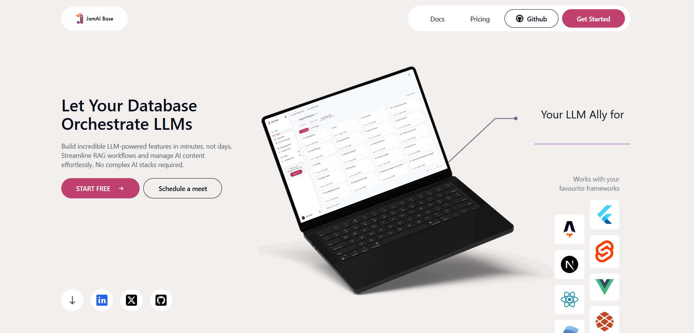
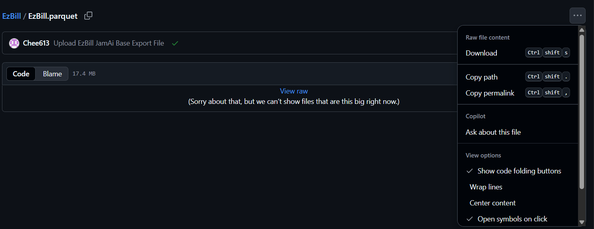
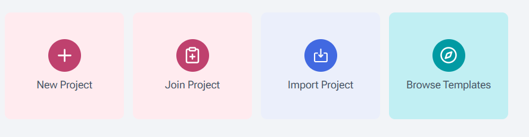
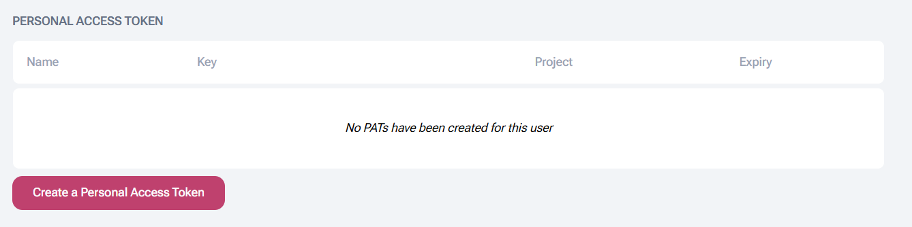
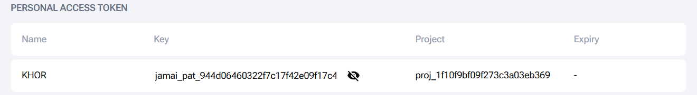
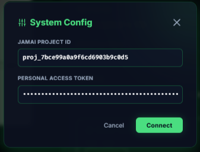
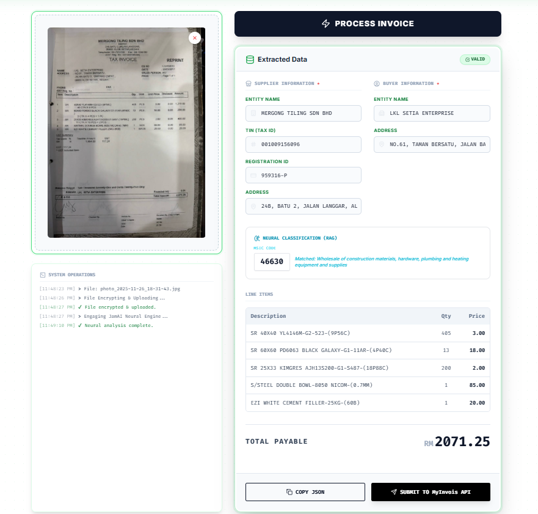

# EzBill - LHDN Compliance Unit

EzBill is an AI-powered tool designed to streamline e-invoicing compliance for Malaysian SMEs. It bridges the gap between physical receipts and the MyInvois standard using JamAI Base.

## 🚀 Setup Guide

### Step 1: Create a JamAI Base Account
1. Visit [JamAI Base](https://www.jamaibase.com/).
2. Click on **"Start Free"** and login using your preferred method.
3. Enter your Organization Name when prompted to complete the setup.

### Step 2: Download the Project File
1. In this repository,locate and click on the file named `EzBill.parquet`.
2. Click the **Menu option (···)** in the top right.
3. Select **Download** to save the raw file.

### Step 3: Import Project to JamAI Base
1. Log in to your JamAI Base dashboard.
2. Select **"Import Project"**.
3. Upload the `EzBill.parquet` file.
4. When prompted, select **EZBill** as the project to import.
5. When **EZBill** appears at the All Projects section, you are go to go.
   

### Step 4: Retrieve Configuration IDs
You need to record specific Table IDs and Keys to connect the frontend.

**A. Generate API Token:**
   * Click on your **Profile Icon** in the top right corner.
   * Select **"Account Settings"**.
   * Click on **"Create a Personal Access Token"**.
   * Enter your name (e.g., "EzBill User") and select the **EzBill Project** from the dropdown.
   * Click **Create**.
   * **Important:** Record the **Key** (PAT) and the **Project ID** shown on the screen.

### Step 5: Connect EzBill (Frontend)
1. Open the `index.html` file from this repository in your web browser or click this [link](https://chee613.github.io/EzBill/)
2. (Optional) Choose your preferred **Language** and **Website Theme** using the toggles in the top bar.
3. Click on the **Settings Icon (⚙️)** located in the top right corner.
4. Enter the recorded details into the System Config modal:
   * **JamAI Project ID:** (From Step 4)
   * **Personal Access Token:** (From Step 4)
5. Click **Connect**.
   

---

## 📖 Usage Guide

1. **Upload Invoice:** Drag and drop your receipt image or click to upload.
2. **Process:** Click the **"Process Invoice"** button. The system will use JamAI Base to extract the data.
3. **Verify:** Review the extracted details in the "Extracted Data" panel.
4. **Copy/Submit:**
   * You may click **"DOWNLOAD JSON"** to download the formatted data for your records.
   * Click **"Submit to MyInvois API"** to finalize the process.

